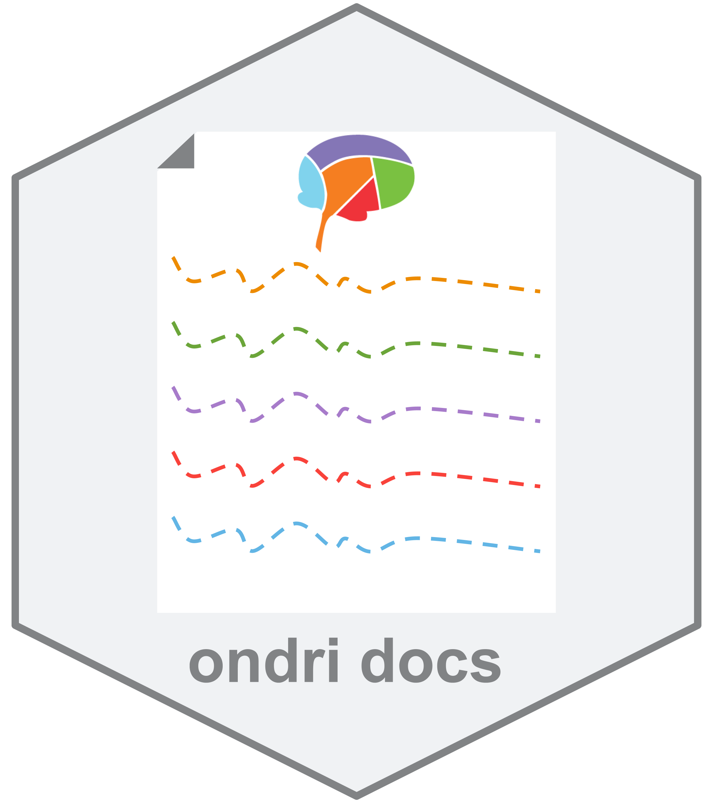

```{r setup, include=FALSE}
knitr::opts_chunk$set(echo = TRUE)
```

# ondridocs 


This repository will hold external documentation for ONDRI software, methods, standards, and related items generally on behalf of the Neuroinformatics & Biostatistics team. 

Unless stated otherwise, all documents here are licensed under CC-BY [see here for more information on Creative Commons licenses](https://creativecommons.org/licenses/by/4.0/?). 


# Available documentation

* [Compendium](./Compendium): A document that primarily contains information on the data standards used in ONDRI. The documentation also includes additional key elements of information about curation, data preparation, and standards.

* [Apps](./Apps): Documentation for the apps and packages available in the [ondri-nibs](https://github.com/ondri-nibs) repository.